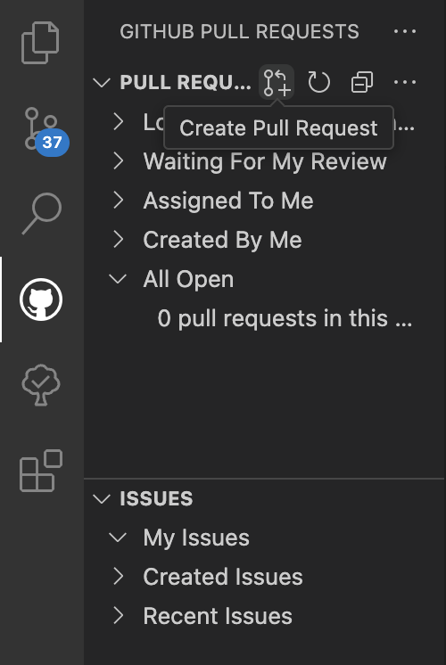
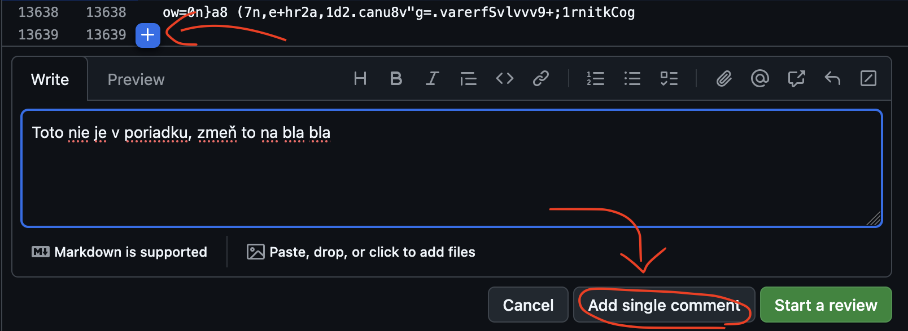

# Poznámky pre contributorov

Dokument slúži pre usmernenia a odporúčania týkajúce sa toho, ako by mal byť projekt vyvíjaný, ako by mali byť štruktúrované súbory, základný code style guide, atď...

## Elementárne veci

- Nezabúdajte, že pre spustenie konkrétnych príkazov (napr. `npm run dev`) sa musíte nachádzať v priečinku pre danú časť stacku aplikácie (napr. pre `npm run dev` musíte byť v priečinku `frontend`, teda: `cd frontend` v koreňovej ceste vášho lokálneho repozitára).
- Všetok kód (funkcie, názvy premenných, atď), vrátane komentárov, sú písané v angličtine, aby tomu rozumel každý rovnako.
- Odporúča sa pre každý nový feature vytvoriť oddelený branch a k tomu branchu vytvoriť pull request, aby bola aspoň nejaká organizácia (viď. sekcia nižšie).
- Je prísne zakázané commitovať sprostosti – komentáre v kóde by mali byť výstižné a slušné, pamätajte že projekt a história commitov budú súčasťou obhajoby projektu.
- Frontend a backend spolu komunikujú výhradne prostredníctvom REST JSON API (server nebude renderovať template priamo v odpovedi).
- Pre frontend sa používa code formatter [Prettier](https://marketplace.visualstudio.com/items?itemName=esbenp.prettier-vscode), pre backend [ruff](https://marketplace.visualstudio.com/items?itemName=charliermarsh.ruff) – oba sú dostupné ako VS Code rozšírenie.
- Pre frontend používajte výlučne Options API! Takže, žiadne `setup`, `ref`, ani podobné záležitosti.

## Ako spraviť pull request vo VS Code

Pointa je robiť čo najminimálnejšie pull requesty (nie gigantické commity s milión zmenami). Napr. idem robiť navigačnú lištu, tak spravím pull request ktorý sa bude týkať iba zmien v navigačnej lište (a nezahrniem do toho ešte aj milión vecí z backendu). Iba ak toto dodržíte tak to bude mať význam, inak to nemá zmysel robiť.

> [!WARNING]
> Pred každým commitom a vytvorením nového branchu si stiahnite najnovšie commity, inak budete pracovať so starou verziou a vzniknú merge conflicty! Urobíte to buď cez `git pull` v terminály, alebo kliknutím na ikonu cyklu (dvoch šípok) vľavom dolnom rohu vo VS Code, vedľa tlačidla s branchom ("main" alebo váš branch). Kliknutím na šípky (🔄) sa synchronizujú commity s GitHub serverom (ktoré tam medzitým mohli pridať ostatní).

Ako na to:

1. Nainštalujte si oficiálne rozšírenie [GitHub Pull Requests](https://marketplace.visualstudio.com/items?itemName=GitHub.vscode-pull-request-github), ak ho nemáte.
2. Predtým, ako urobíte prvý commit s vašimi zmenami, si vytvorte nový branch. Úplne v ľavom dolnom rohu vo VS Code je ikona branchu a vedľa neho je napísané na akom branchi ste (uistite sa, že ste na branchi "main").
3. Kliknite na vysvietené tlačidlo v ľavom dolnom rohu VS Code (kde je text "main"). V hornej časti sa zobrazí nové okno: zvoľte možnosť "Create new branch...".
4. Musíte vložiť meno pre váš branch. **Prosím, branche menujte podľa konvencie nasledovne**: `<iniciály vášho mena a priezviska>/<stručný názov toho, čo pridávate>`. Napríklad, ak som Jožko Mrkvička a robím navigačnú lištu, môj názov branchu bude `jm/header-navbar` (píšte malými písmenami anglickej abecedy, namiesto medzier používajte pomlčku: `-`). To zabezpečí, že budeme vedieť ihneď identifikovať, kto má daný branch na starosti.
5. Po vytvorení branchu sa budete automaticky nachádzať na vašom novom branchi, ktorý sa rozvetvuje od mainu. Na prvý pohľad sa nič nezmení, no všetky commity od tohto momentu budú patriť výhradne vášmu branchu a neovplyvnia hlavný `main` branch.
6. Urobte, čo potrebujete – niečo naprogramujte, zmeňte kód, atď...
7. Ak ste urobili prácu ktorá je hodná commitu, v ľavej navigačnej lište vo VS Code (kde sú súbory, extensions, atď...) je aj tlačidlo pre commit ("Source Control"). Klinite naň.
8. Do poľa "Message" napíšte stručný popis toho, čo ste práve dosiahli. Prosím, pokúste sa písať výstižné poznámky k veci, nie blbosti.
9. Pod poľom "Message" sa nachádza veľké, modré tlačidlo "Commit". Máte na výber niekoľko možností:
    1. Buď kliknete na commit a vaše zmeny zostanú vo vašom lokálnom repozitári, a budete ich musieť manuálne odoslať na GitHub server (pushnúť)
    2. Alebo kliknete na šípku smerujúcu dole, ktorá sa nachádza v tlačidle napravo a vyberiete možnosť "Commit & Sync" – to zabezpečí, že váš commit sa automaticky odošle na GitHub server a zároveň sa zosynchronizujú všetky commity ktoré medzitým niekto odoslal na GitHub pred vami (v aktuálnom branchi). Ak máte vlastný branch, pravdepodobne sa vám nikto nebude pliesť pod nohy, ale je dobré zmeny synchronizovať aby sme si boli istý že máme za každým commitom najnovšiu verziu branchu (čo minimalizuje šance na vznik merge conflictov).
    3. Môžte taktiež zvoliť možnosť "Commit & Create Pull Request", a pushnúť zmeny na server v tom istom kroku – v tomto prípade pokračujte od kroku 12. nižšie.
10. Commity sú teraz už na GitHube, vo vašom branchi. Môžete ich zobraziť tým, že na webovej stránke GitHubu vyberiete príslušný branch cez dropdown v ľavej hornej časti (hneď pod názvom repozitára).
11. Avšak, ešte neexistuje žiadny pull request. Ten musíte vytvoriť tak, že kliknete na logo GitHubu (mačkochobotnicová vec v kruhu) v paneli na ľavo (kde je aj "Source Control" pre tvorbu commitov). Mala by to byť časť "Pull Requests":

12. Zobrazí sa nové okno. Ak sa nachádzate na správnom branchi (vašom), tak ako "Base" (branch, do ktorého sa merguje) bude automaticky nastavený na "main". Sekcia "Merge" (branch, ktorý mergujeme) bude nastavený automaticky na váš branch. Ak je všetko v poriadku, pokračujte ďalej.
13. Ako názov pull requestu bude spravidla posledná commit správa. Môžete to zmeniť, aby ste stručne popísali váš pull request.
14. Sekcia "Description" sa používa pre detailnejší opis toho, čo ste spravili. Je to dobrovoľné – ak názov pull requestu postačuje, kľudne skipnite "Description".
15. Konečne, kliknutím na "Create" vytvoríte nový pull request, ktorý sa odošle na GitHub. Následne vám ho niekto skontroluje, prípadne dá feedback pre opravu. Alebo ho mergne do hlavného branchu. Môžete taktiež priradiť commit niekomu ("assignee"), alebo požiadať o review.

## Ako reviewnúť pull request

1. Choďte na stránku pull requestu (napr.: #1)
2. Kliknite na sekciu "Files Changed" (v hornej časti, pod názvom commitu)
3. Skontrolujte, či je všetko v poriadku. Ak sa nastavíte na príslušný riadok, vľavo sa zobrazí modré "Plus" tlačidlo (➕). Môžete ho použiť pre zanechanie komentáru pre aktuálny riadok v súbore a dať nejaký feedback:

4. Ak ste hotový, kliknite vpravo hore na zelené tlačidlo "Review changes". Zmeny môžete schváliť (approve), odmietnuť (reject) alebo iba dať feedback. Toto nemá žiadny vplyv na to, či môžeme pull request neskôr mergnúť, je to iba váš osobný názor na pull request a či by sa niečo malo zmeniť atď...

Príklad PR: #1
